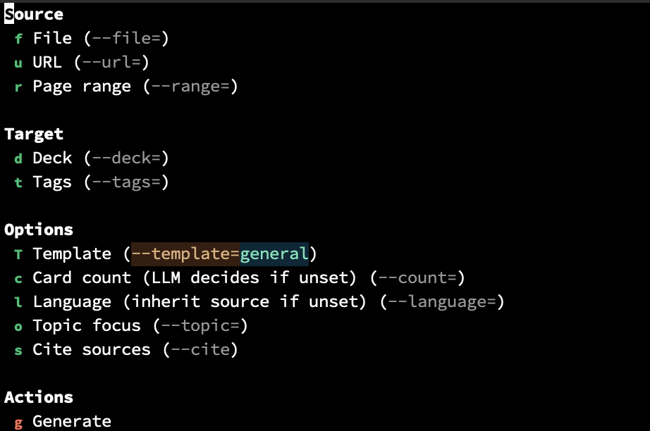

# `anki-noter`: AI-power Anki notes generator

An Emacs package that uses an LLM (via [gptel](https://github.com/karthink/gptel)) to generate Anki flashcards from various source materials and inserts them as org-mode headings formatted for [anki-editor](https://github.com/louietan/anki-editor).

## Overview

You provide source material (org files, markdown, text, PDFs, or web pages) and anki-noter sends it to an LLM via gptel, which generates flashcard question/answer pairs. These are inserted into the current org buffer as headings in anki-editor format. You can then review and edit the cards in org-mode and push them to Anki via anki-editor.

## Dependencies

- **[gptel](https://github.com/karthink/gptel)** (>= 0.9) — LLM integration (request handling, backend selection, context management)
- **[anki-editor](https://github.com/louietan/anki-editor)** (>= 0.3) — Anki synchronization (pushing notes to Anki via AnkiConnect), deck and tag completion
- **[transient](https://github.com/magit/transient)** — menu interface (bundled with Emacs 28.1+)
- **Emacs** >= 28.1

## Installation

### With elpaca or straight.el

```elisp
(use-package anki-noter
  :elpaca (:host github :repo "benthamite/anki-noter"))
```

### Manual

Clone the repository and add it to your `load-path`:

```elisp
(add-to-list 'load-path "/path/to/anki-noter")
(require 'anki-noter)
```

## Input sources

### Supported formats

1. **Org-mode files** (`.org`)
2. **Markdown files** (`.md`)
3. **Plain text files** (`.txt`)
4. **PDFs** — sent natively to the LLM for backends that support it (e.g. Claude, Gemini); otherwise falls back to text extraction via a configurable command (default: `pdftotext`)
5. **Web pages** — fetched automatically given a URL; readable content is extracted using `url-retrieve` + `shr`

### Input methods

All input methods are configured through the transient menu (`M-x anki-noter`):

- **Current buffer or active region** (default): if no file or URL is set, cards are generated from the current buffer content (or the selected region, if active)
- **File** (`f`): set a file path as the source
- **URL** (`u`): set a URL as the source

When using current buffer/region, the content is sent to the LLM directly. When using a file path, the file is added via `gptel-context`. When using a URL, the page is fetched, cleaned, and sent as text.

### Long documents

For documents that may exceed the LLM's context window, you can specify a page range or section. For PDFs, set a page range via `r` in the transient (e.g. "1-20"). For text-based formats, select a region in the buffer before opening the transient.

## Usage

Run `M-x anki-noter` to open the transient menu. The menu is organized into three groups.



The transient initializes its values from your defcustom settings and the current org context, so you only need to adjust what differs from your defaults.

## Card format

Each generated card is an org heading inserted as a child of the current heading:

```org
*** Card front text (the question)
:PROPERTIES:
:ANKI_FORMAT: nil
:ANKI_DECK: Main::Started::Implementation intentions
:ANKI_NOTE_TYPE: Basic
:ANKI_TAGS: tag1 tag2
:END:

Card back text (the answer)

Source: /Thinking, Fast and Slow/, pp. 42-58
```

Key format rules:
- **Heading text** = front of card
- **Body text** = back of card
- `ANKI_NOTE_ID` and `ID` are omitted on new cards (assigned when pushed to Anki)
- `ANKI_FORMAT` is included; value is configurable (default: `nil`, meaning org-mode format)
- `ANKI_NOTE_TYPE` is always `Basic`
- Heading level is one deeper than the current heading at point

### Deck and tags

Deck and tags are resolved in the following order:

1. **Transient value**: if explicitly set via `d` (deck) or `t` (tags) in the transient menu, that value is used.
2. **Org context inheritance**: anki-noter walks up the org tree looking for `ANKI_DECK` and `ANKI_TAGS` properties.
3. **Interactive prompt**: if neither of the above yields a value, you are prompted interactively (with completion from Anki via anki-editor).

The LLM may also suggest additional tags based on content; these are appended to any inherited tags.

### Source citation

When `anki-noter-cite-sources` is non-nil (or the cite sources toggle `s` is enabled in the transient), each generated card includes a reference to its source:
- For files: the file name and page range if applicable
- For URLs: the URL
- For buffer content: the buffer name

The citation is appended to the card back as a separate paragraph. By default, citation is off.

## Prompt templates

### Built-in templates

1. **general** (default) — Factual Q&A cards suitable for non-fiction material. Extracts key facts, definitions, relationships, and cause-effect pairs.
2. **language** — Language learning: vocabulary, grammar rules, usage examples. Supports bilingual cards when output language differs from source.
3. **programming** — Programming & CS: concepts, API facts, code behavior, algorithm properties. Tests understanding, not just recall.

### Custom templates

Add entries to `anki-noter-prompt-templates`:

```elisp
(add-to-list 'anki-noter-prompt-templates
             '("philosophy" . "You are generating flashcards about philosophy. Focus on arguments, key claims, distinctions, and thought experiments."))
```

Each entry is a cons cell of `(NAME . PROMPT-STRING)`.

## Incremental generation

When generating cards from a source that has already produced cards (e.g. you want more cards from the same chapter), anki-noter collects the front text of all existing anki-editor sibling headings and includes them in the prompt. The LLM is instructed not to duplicate any of the existing cards.

## Post-generation

After inserting the generated cards, anki-noter prompts: "Push N new notes to Anki? (y/n)". If yes, `anki-editor-push-notes` is called on the newly inserted headings. This can be automated with `anki-noter-auto-push`.

## Customization

| Variable | Type | Default | Description |
|---|---|---|---|
| `anki-noter-card-count` | integer or nil | `nil` | Default target number of cards (nil = LLM decides) |
| `anki-noter-default-template` | string | `"general"` | Default prompt template name |
| `anki-noter-prompt-templates` | alist | (built-in) | Named prompt templates |
| `anki-noter-language` | string or nil | `nil` | Output language (nil = same as source) |
| `anki-noter-anki-format` | string or nil | `nil` | Value for `ANKI_FORMAT` property |
| `anki-noter-cite-sources` | boolean | `nil` | If non-nil, append a source citation to each card back |
| `anki-noter-cite-format` | string | `"Source: %s"` | Format string for source citation |
| `anki-noter-pdf-fallback-command` | string | `"pdftotext %s -"` | Command for PDF text extraction when native PDF input is unavailable |
| `anki-noter-auto-push` | boolean | `nil` | If non-nil, push to Anki automatically without prompting |

## LLM integration

anki-noter uses gptel as the LLM transport layer. Your configured gptel backend and model are used — anki-noter does not hardcode any provider. Native PDF input is supported for backends that handle it (Claude, Gemini); other backends fall back to `pdftotext`.

## Error handling

- If gptel is not configured or no backend is available, a `user-error` is signaled with setup instructions.
- If anki-editor is not available (for push), a warning is shown but card generation still works.
- If PDF native input fails (unsupported backend), the fallback command is tried. If that also fails, an error with instructions to install `pdftotext` is signaled.
- If URL fetching fails, an error with the HTTP status is signaled.
